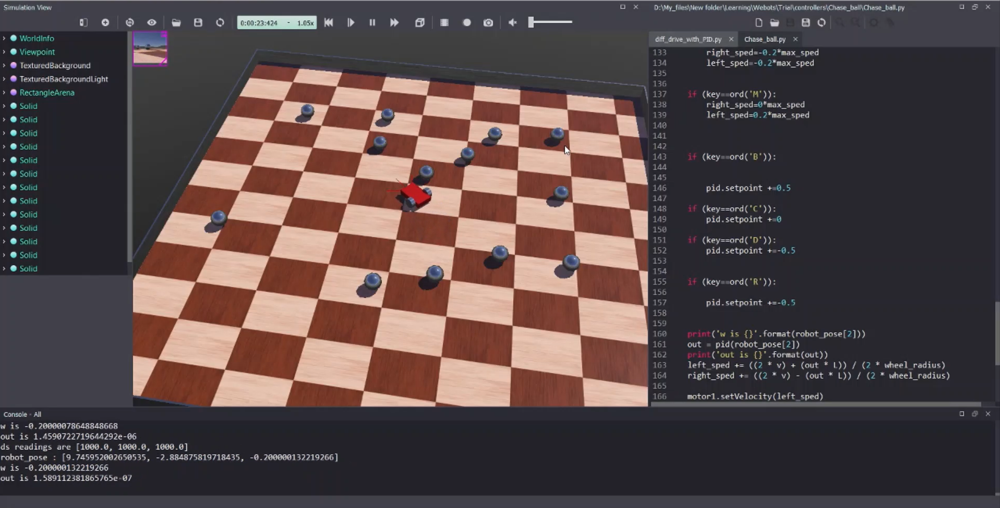

## This project is a simulation of a differential drive mobil robot that uses dead reckoning to estimate its position and orientation

## The robot has three infrared sensors mounted to the front of the robot, it uses these sensors to chase the balls and hit them
## PID control and fuzzy control are used to control the orientation angle for the robot, there are mainly two controllers, 
## fuzzy_diff: which uses a Fuzzy logic controller based on the scikit-fuzzy package
## diff_drive_with_PID: which uses a PID controller based on simple-pid python package
## You can always set the right and left speeds to zero and use the keyboard input to choose an angle setpoint and see the robot
## rotate to compare the behaviours of these controllers
## Check out [This link](https://www.youtube.com/watch?v=CDOrTKQAOqs&ab_channel=KajalGada) to help you understand how this code was written
## and how to apply the diff. drive mobile robot kinematics 
## Check out this image that shows the response comparison between Fuzzy logic and PID, Fuzzy logic controller needs more tuning 
## to get better performance
## The data folder contains a jupyter notebook that I used to generate the response plot using matplotlib
## 
## The robot gets a little crazy sometimes when the error signal gets pretty high, I need to tune this mores
## Hope you like the project 
